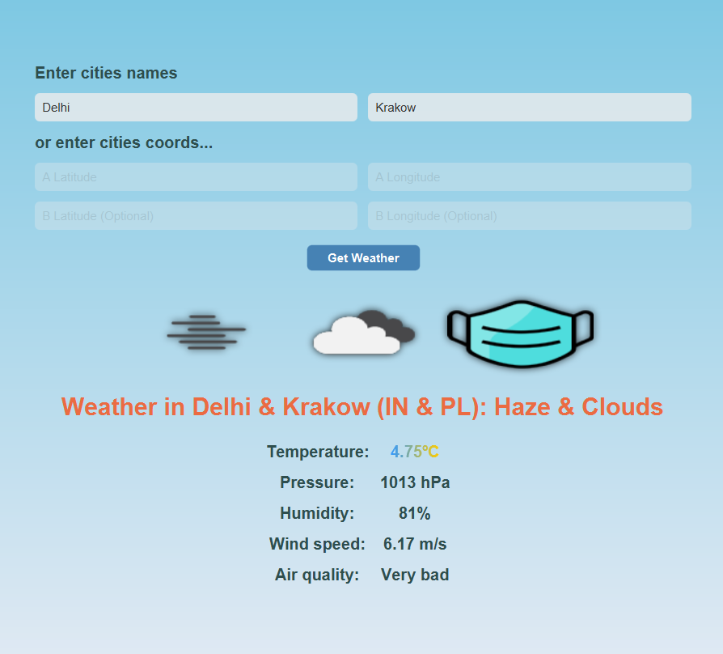

# Dokumentacja projektu WeatherAPP

## Autorzy
- Paweł Motyka
- Marcin Saja
- Michał Czajor
- Adrian Żerebiec

## Cel aplikacji

Nasza aplikacja jest przeznaczona dla osób chcących sprawdzić pogodę przed wyjściem z domu. Powinna ona pomóc w doborze odpowiednich ubrań w zależności od aur panującej za oknem o danej porze.

## Wersja Javy oraz Gradle'a

W naszym projekcie korzystamy z Java17. Zalecaną wersją Gradle'a jest natomiast Gradle 8.4. . JVM musi być w wersji 17 lub wyższej.

## Uruchomienie projektu

Program uruchamiamy poleceniem `gradlew run` w głównym katalogu projektu. W pewnych sytuacjach jednak mogą się pojawić problemy. Wtedy zalecamy, aby skorzystać z komendy `gradle run`.
Jeśli i to nie pomoże, najlepiej usunąć z plików gradle-wrapper.jar znajdujących się w gradle/wrapper. Wtedy trzeba uruchomić program z pomocą komendy `gradle wrapper run`.

## Milestone 1

W tym Milesone'ie naszym celem było stworzenie pierwszej wersji aplikacji, która pozwala nam na uzyskanie informacji o pogodzie w danym miejscu.
To, jaka jest pogoda, możemy uzyskać dzięki wprowadzeniu w GUI koordynatów lub nazwy miejscowości, a zewnętrzne API zwróci nam informacje o pogodzie.

### Pomysł

W celu stworzenia aplikacji postanowiliśmy użyć wzorca projektowego MVP. Pozwala nam to oddzielić warstwę biznesową od widoku aplikacji. To zapewnia nam, że każdy z komponentów ma swoje konkretne zadanie, i ewentualna zmiana jednego z nich nie powoduje konieczności dużych zmian w reszcie.
Interface aplikacji stworzyliśmy za pomocą FXML, dzięki czemu zmiany w wyglądzie mogą być niezależne od reszty.

#### Dlaczego MVP?

Wzorzec MVP pozwala nam na oddzielenie logiki biznesowej od widoku. Dzięki temu możemy łatwo zmieniać widok aplikacji bez konieczności zmiany logiki biznesowej.
Dodatkowo dzięki temu wzorcowi możemy łatwo testować aplikację. Co więcej, w sposób zdecydowany pomogło nam w zorganizowaniu pracy w grupie, gdyż mogliśmy pracować niezależnie od siebie w wielu przypadkach.

#### Dlaczego converter?

Converter pozwala nam na konwersję danych z formatu JSON na obiekt klasy WeatherData. Dzięki temu możemy łatwo operować na danych otrzymanych z API.

#### Dlaczego Logger?

Dzięki Loggerowi możemy łatwo logować informacje o działaniu aplikacji. To pozwala nam łatwiej znaleźć ewentualne błędy w aplikacji.

#### Dlaczego wykorzystaliśmy Guice?

Guice pozwala nam na wstrzykiwanie zależności. Dzięki niemu klasy nie muszą tworzyć obiektów zależności samodzielnie, co ułatwia zmianę implementacji bez zmiany kodu klas klientów.
Wstrzykiwanie zależności ułatwia nam także podstawianie atrap obiektów podczas testowania. Co więcej, zależności są zdefiniowane w oddzielnych modułach, a to ułatwia nam dodawanie nowych funkcji do aplikacji.

### Opis działania

Po uruchomieniu aplikacji, użytkownikowi wyświetla się okno, w którym może wprowadzić nazwę miasta lub jego koordynaty. Po wprowadzeniu danych i kliknięciu przycisku "Search" aplikacja pobiera dane z zewnętrznego API i wyświetla je użytkownikowi.

### Zależności

W projekcie użyliśmy następujących zależności:
```
dependencies {
	testImplementation group: 'org.junit.jupiter', name: 'junit-jupiter-api', version: '5.10.1'
    testRuntimeOnly group: 'org.junit.jupiter', name: 'junit-jupiter-engine', version: '5.10.1'
    implementation("com.squareup.okhttp3:okhttp:4.11.0")
    implementation 'com.google.code.gson:gson:2.10.1'
    implementation group: 'com.google.inject', name: 'guice', version: '5.0.1'
    testImplementation 'org.mockito:mockito-core:3.12.4'
    testImplementation "org.testfx:testfx-core:4.0.17"
    testImplementation group: 'org.hamcrest', name: 'hamcrest', version: '2.1'
    testImplementation "org.testfx:testfx-junit5:4.0.17"
}

```
Pierwsze dwie zależności są potrzebne do testowania aplikacji. Do testowania aplikacji również przydatne jest mockito, gdyż pozwala nam na tworzenie atrap.
OkHttp3 pozwala nam na komunikację z zewnętrznym API. Dzięki Gson'owi możemy łatwiej konwertować przydatne nam w implementacjach informacje. Guice natomiast pozwala nam na wstrzykiwanie zależności.
TestFX pozwala nam na testowanie aplikacji z GUI w stosunkowo łatwy sposób.

### Struktura projektu

Nasz projekt podzielony jest na wiele pakietów oraz klas. Poniżej przedstawiamy krótki schemat struktury projektu.

```
- src/
   - main/
      - java/
         - pl.edu.agh.to2.WeatherApp/
            - api/
            - exceptions/
            - logger/
            - model/
            - presenter/
            - utils/
            - view/
            - App.java
            - Main.java
      - resources/
        - pl.edu.agh.to2.WeatherApp/
  - test/
    - java/
      - pl.edu.agh.to2.WeatherApp/
            - api/
            - logger/
            - model/
            - presenter/
            - view/
            -MainTest.java
```
### Opisy pakietów i klas
#### Pakiet api
Pakiet Api zawiera klasy odpowiedzialne za komunikację z zewnętrznym API pogodowym. W tym celu wykorzystujemy bibliotekę OkHttp3.

Klasy:
1. **WeatherDataProvider**: wykonuje zapytania do api pogodowego i zwraca dane dotyczące pogody.

#### Pakiet exceptions

Pakiet exceptions zawiera klasy odpowiedzialne za obsługę wyjątków.

Klasy:
1. **DataFetchException**: klasa odpowiedzialna za obsługę wyjątków związanych z pobieraniem danych

#### Pakiet logger
Zawiera metody pozwalające na logowanie informacji oraz ewentualnych błędów w aplikacji.

Klasy:
1. **ConsoleSerializer**: klasa odpowiedzialna za logowanie informacji w konsoli
2. **IMessageSerializer**: interfejs zawierający metody pozwalające na logowanie informacji
3. **Logger**: klasa odpowiedzialna za obsługę logowania informacji


#### Pakiet model
Zawiera elementy modelu, konwertuje na obiektu klasy WeatherData za pomocą biblioteki GSon.

Klasy:
1. **WeatherModule**: definiuje dostawców dla interfejsów, zapewniając im konkretne implementacje, z pomocą Guice
2. **WeatherModel**: interfejs zawierający metody pozwalające na pobranie informacji o pogodzie
3. **weatherData/WeatherData**: klasa zawierająca informacje o pogodzie przygotowana z myślą o API OpenWeatherMap
4. **weatherData/JsonData/...**: w tym katalogu znajdują się klasy poszczególnych elementów modelu takie jak:
   - CloudsDTO: klasa zawierająca informacje o zachmurzeniu procentowym
   - CoordDTO: klasa zawierająca informacje o współrzędnych geograficznych
   - MainInfoDTO: klasa zawierająca informacje o temperaturze, ciśnieniu, wilgotności czy odczuwalnej temperaturze
   - SysDTO: klasa zawierająca informacje o kraju, godzinie wschodu i zachodu słońca
   - TotalFallDTO: klasa zawierająca informacje o opadach w ciągu ostatniej godziny oraz w ciągu ostatnich 3 godzin
   - WeatherDTO: klasa zawierająca informacje o pogodzie (np. opis, ikona)
   - WindDTO: klasa zawierająca informacje o wietrze (np. prędkość, kierunek)
5. **Impl/WeatherModelImpl**: klasa implementująca interfejs WeatherModel, zawiera metody pozwalające na asynchroniczne pobranie informacji o pogodzie
6. **converter/GsonConverter**: klasa odpowiedzialna za konwersję danych z formatu JSON na obiekt klasy WeatherData
7. **converter/IResponseToModelConverter**: interfejs zawierający metodę pozwalające na konwersję danych z formatu JSON na obiekt klasy WeatherData

#### Pakiet presenter
Zawiera implementację prezentera odpowiedzialną za komunikację między widokiem a modelem.

Klasy:
1. **WeatherPresenter**: interfejs zawierający metody pozwalające na komunikację między widokiem a modelem
2. **WeatherPresenterImpl**: obsługuje prezentację danych w widoku WeatherView, jednocześnie komunikując się z modelem WeatherModel

#### Pakiet utils
Ułatwia ładowanie widoków fxml.

Klasy:
1. **FXMLLoaderUtility**: pomocnicza klasa do ładowania widoków fxml

#### Pakiet view
Zawiera implementację widoku.

Klasy:
1. **WeatherView**: zajmuje się wyświetlaniem widoku aplikacji, komunikuje się z modelem poprzez prezentera

#### Osobne klasy
1. **App**: zawiera metody odpowiedzialne za inicjalizację aplikacji oraz za wystartowanie
2. **Main**: uruchamia aplikację

#### Testy jednostkowe

W celu testowania aplikacji stworzyliśmy testy jednostkowe. Sprawdzają one poprawność działania najczęściej używanych metod np. setterów, convertera czy apiCaller.
Dzięki nim możemy łatwo sprawdzić, czy poszczególne komponenty aplikacji działają poprawnie.

### Diagram zależności
Poniższy diagram przedstawia zależności między klasami w naszym projekcie.


Jak widać, w naszym projekcie występuje dużo zależności.
Przede wszystkim możemy zauważyć zależność wynikającą z zastosowania wzorca MVP.
Widzimy, że WeatherPresenter jest pośrednikiem w porozumiewaniu się między widokiem WeatherView a modelem WeatherModel.
Nie może także dziwić, iż koniec końców wszystko sprowadza się do naszej App, które obsługuje naszą aplikację.

### Przykład działania


Jak widać po wprowadzeniu nazwy miasta i kliknięciu przycisku "Search" aplikacja pobiera dane z zewnętrznego API i wyświetla je użytkownikowi.
Możemy zauważyć, iż pogoda w Madrycie jest pochmurna, a ciśnienie do około 1016 hPa.
Dodatkowo możemy sprawdzać pogodę po koordynatach geograficznych.


Widzimy, że aplikacja działa poprawnie i wyświetla nam informacje o pogodzie w danym miejscu.


### Podsumowanie

W tym Milestone'ie udało nam się stworzyć szkielet aplikacji, który pozwala na pobieranie informacji o pogodzie z zewnętrznego API.
Dzięki zastosowaniu wzorca MVP możemy łatwo zmieniać widok aplikacji bez konieczności zmiany logiki biznesowej.
Naszym zdaniem, dzięki zastosowaniu Guice, MVP itp., nasz projekt jest skalowalny i łatwy w rozbudowie.


## Milestone 2

W tym Milestone'ie naszym celem było rozszerzenie możliwości aplikacji. Od teraz chcemy, aby użytkownik mógł sprawdzić pogodę w dwóch miejscach jednocześnie.
Może to być przydatatne, np. możemy sprawdzić pogodę w miejscu pracy i w miejscu zamieszkania. Dodatkowo dodaliśmy ikonki pogody oraz maseczki.

### Pomysł

Naszym głównym zamysłem było to, aby zbytnio nie komplikować i nie zmieniać struktury projektu. Dlatego też postanowiliśmy rozszerzyć nasz model o nowe klasy i funkconalności.
Korzystamy z tego samego API, co w poprzednim Milestone'ie, dlatego też nie musieliśmy zmieniać klasy DataProvider, a jedynie ją rozszerzyliśmy.

#### Dlaczego dodaliśmy ikonki pogody?

Dodaliśmy ikonki pogody, aby ułatwić użytkownikowi korzystanie z aplikacji. Dzięki nim użytkownik może szybko sprawdzić pogodę w danym miejscu, bez konieczności czytania opisu pogody.

#### Dlaczego dodaliśmy maseczki?

W wielkich miastach smog jest poważnym problemem. Dlatego też postanowiliśmy dodać maseczki, aby użytkownik mógł łatwo sprawdzić, czy powinien założyć maseczkę, czy nie.

#### Jak działa WeatherDataMerger?

WeatherDataMerger pozwala nam na scalenie danych o pogodzie z dwóch różnych miejsc. Scalamy te, które wydają się nam ważniejsze

### Opis działania

Aplikacja działa analogicznie jak w poprzednim Milestone'ie. Po uruchomieniu aplikacji, użytkownikowi wyświetla się okno, w którym może wprowadzić nazwę miasta lub jego koordynaty. Jednak od teraz możemy sprawdzać pogodę w dwóch miejscach jednocześnie.
Po wprowadzeniu danych i kliknięciu przycisku "Get Weather" aplikacja pobiera dane z zewnętrznego API i wyświetla je użytkownikowi wraz z odpowiednimi ikonkami.

### Zależności

Nie zmieniliśmy zależności w stosunku do poprzedniego Milestone'a.

### Struktura projektu

W tym Milestone'ie nie zmieniliśmy struktury projektu znacznie. Rozbudowały się one jednak o nowe klasy.

### Opisy pakietów i klas

#### Pakiet api 

Pakiet Api zawiera klasy odpowiedzialne za komunikację z zewnętrznym API pogodowym. W tym celu wykorzystujemy bibliotekę OkHttp3.

Klasy:
1. **DataProvider**: wykonuje zapytania do api pogodowego i zwraca dane dotyczące pogody. Od teraz także pobiera dane o zanieszyszczeniu powietrza oraz pomaga w uzyskiwaniu ikon.

#### Pakiet exceptions

Pakiet exceptions zawiera klasy odpowiedzialne za obsługę wyjątków.

Klasy:
1. **DataFetchException**: klasa odpowiedzialna za obsługę wyjątków związanych z pobieraniem danych
2. **GeocodingException**: klasa odpowiedzialna za obsługę wyjątków związanych z geokodowaniem

#### Pakiet logger

Nie uległ zmianie w stosunku do poprzedniego Milestone'a.

#### Pakiet model

Zawiera elementy modelu, konwertuje na obiekty klasy WeatherData za pomocą biblioteki GSon. Od teraz posiada także elementy związane z AirPolutionData oraz GeocodingData.

Klasy:
1. **airPollutionData/json/AirPollutionData**: klasa zawierająca informacje o zanieczyszczeniu powietrza przygotowana z myślą o API OpenWeatherMap.
2. **airPollutionData/json/ComponentsDTO**: klasa zawierająca informacje o zanieczyszczeniu powietrza (np. dwutlenek siarki, dwutlenek azotu, ozon)
3. **airPollutionData/json/AirMainInfoDTO**: klasa posiada dokładną informację o poziomie zanieczyszczenia w skali 1-5
4. **airPollutionData/AirListElementDTO**: klasa trzymająca MainInfoDTO oraz ComponentsDTO
5. **geoCodingData/GeocodingData**: klasa zawierająca informacje o geokodowaniu przygotowana z myślą o API OpenWeatherMap.
6. **impl/WeatherModelImpl**: klasa implementująca interfejs WeatherModel, zawiera metody pozwalające na asynchroniczne pobranie informacji o pogodzie, zanieczyszczeniu powietrza oraz geokodowaniu.
7. **responseConverter/GsonConverter**: klasa odpowiedzialna za konwersję danych z formatu JSON na obiekt klasy WeatherData i AirPollutionData.
8. **weatherData/WeatherData**: klasa zawierająca informacje o pogodzie przygotowana z myślą o API OpenWeatherMap, teraz także zawiera informacje o zanieczyszczeniu powietrza.
9. **weatherData/WeatherDataMerger**: klasa odpowiedzialna za scalanie danych o pogodzie i zanieczyszczeniu powietrza z dwóch różnych miejsc.

#### Pakiet presenter

Zawiera implementację prezentera odpowiedzialną za komunikację między widokiem a modelem.

Klasy:
1. **impl/WeatherPresenterImpl**: obsługuje prezentację danych w widoku WeatherView, jednocześnie komunikując się z modelem WeatherModel. Od teraz obsługuje zapytania dla dwóch miejsc, a także dodaje ikonki.


#### Pakiet utils

Zawiera dodatkowe pomocnicze metody i klasy.

Klasy:
1. **FXMLLoaderUtility**: pomocnicza klasa do ładowania widoków fxml
2. **Constans**: pomocnicza klasa zawierająca stałe
3. **TempCalculator**: pomocnicza klasa do obliczania temperatury odczuwalnej na podstawie wzoru
4. **converter/AirQualityConverter**: klasa odpowiedzialna za obrobienie danych o zanieczyszczeniu powietrza, aby były bardziej czytelne dla użytkownika

#### Pakiet view

Zawiera implementację widoku.

Klasy:
1. **WeatherView**: zajmuje się wyświetlaniem widoku aplikacji, komunikuje się z modelem poprzez prezentera. Teraz możemy wprowadzać dwa miejsca, a także wyświetlać ikonki pogody.


### Diagram zależności
Poniższy diagram przedstawia zależności między klasami w naszym projekcie. [Stan na 12:12 2023-12-12]


Jak widać, liczba zależności trochę się zwiększyła. Niezachwiany został jednak podział na przyjęty na poczatku zgodny ze wzorcec MVP. 

### Przykład działania


[Stan na 12:12 2023-12-12]
Jak widać po wprowadzeniu nazwy miast i kliknięciu przycisku "Get Weather" aplikacja pobiera dane z zewnętrznego API i wyświetla je użytkownikowi.
Widzimy, że w porównaniu do poprzedniego Milestone'a, aplikacja wyświetla nam informacje o pogodzie w dwóch miejscach jednocześnie.
Do tego zastosowaliśmy ikonki pogody, aby ułatwić użytkownikowi korzystanie z aplikacji. Co więcej, popracowaliśmy nad wyglądem aplikacji, aby była bardziej przyjemna.

### Podsumowanie

W tym Milestone'ie udało nam się rozszerzyć możliwości aplikacji. Udało się poprawić znacząco wygląd aplikacji, a także
wprowadzić nowe funkcjonalności takie jak wyświetlanie ikonek pogody czy maseczek.
Także aplikacja stała się bardziej przydatna dla użytkowników, gdyż mogą sprawdzać pogodę w dwóch miejscach.