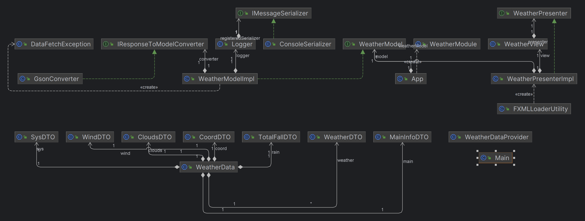
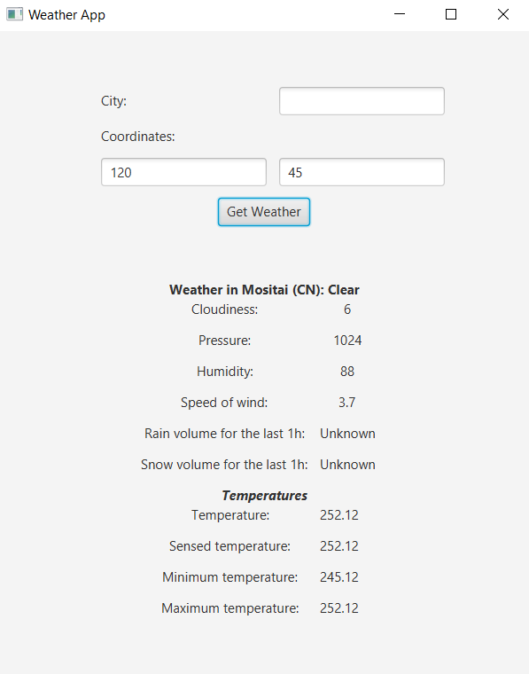

# Dokumentacja projektu WeatherAPP

## Autorzy
- Paweł Motyka
- Marcin Saja
- Michał Czajor
- Adrian Żerebiec

## Cel aplikacji

Nasza aplikacja jest przeznaczona dla osób chcących sprawdzić pogodę przed wyjściem z domu. Powinna ona pomóc w doborze odpowiednich ubrań w zależności od aur panującej za oknem o danej porze.

## Uruchomienie projektu

Program uruchamiamy poleceniem `gradle run` w głównym katalogu projektu.

## Milestone 1

W tym Milesone'ie naszym celem było stworzenie pierwszej wersji aplikacji, która pozwala nam na uzyskanie informacji o pogodzie w danym miejscu.
To, jaka jest pogoda, możemy uzyskać dzięki wprowadzeniu w GUI koordynatów lub nazwy miejscowości, a zewnętrzne API zwróci nam informacje o pogodzie.

### Pomysł

W celu stworzenia aplikacji postanowiliśmy użyć wzorca projektowego MVP. Pozwala nam to oddzielić warstwę biznesową od widoku aplikacji. To zapewnia nam, że każdy z komponentów ma swoje konkretne zadanie, i ewentualna zmiana jednego z nich nie powoduje konieczności dużych zmian w reszcie.
Interface aplikacji stworzyliśmy za pomocą FXML, dzięki czemu zmiany w wyglądzie mogą być niezależne od reszty.

#### Dlaczego MVP?

Wzorzec MVP pozwala nam na oddzielenie logiki biznesowej od widoku. Dzięki temu możemy łatwo zmieniać widok aplikacji bez konieczności zmiany logiki biznesowej.
Dodatkowo dzięki temu wzorcowi możemy łatwo testować aplikację. Co więcej, w sposób zdecydowany pomogło nam w zorganizowaniu pracy w grupie, gdyż mogliśmy pracować niezależnie od siebie w wielu przypadkach.

#### Dlaczego converter?

Converter pozwala nam na konwersję danych z formatu JSON na obiekt klasy WeatherData. Dzięki temu możemy łatwo operować na danych otrzymanych z API.

#### Dlaczego Logger?

Dzięki Loggerowi możemy łatwo logować informacje o działaniu aplikacji. To pozwala nam łatwiej znaleźć ewentualne błędy w aplikacji.

#### Dlaczego wykorzystaliśmy Guice?

Guice pozwala nam na wstrzykiwanie zależności. Dzięki niemu klasy nie muszą tworzyć obiektów zależności samodzielnie, co ułatwia zmianę implementacji bez zmiany kodu klas klientów.
Wstrzykiwanie zależności ułatwia nam także podstawianie atrap obiektów podczas testowania. Co więcej, zależności są zdefiniowane w oddzielnych modułach, a to ułatwia nam dodawanie nowych funkcji do aplikacji.

### Opis działania

Po uruchomieniu aplikacji, użytkownikowi wyświetla się okno, w którym może wprowadzić nazwę miasta lub jego koordynaty. Po wprowadzeniu danych i kliknięciu przycisku "Search" aplikacja pobiera dane z zewnętrznego API i wyświetla je użytkownikowi.

### Zależności

W projekcie użyliśmy następujących zależności:
```
dependencies {
   testImplementation group: 'org.junit.jupiter', name: 'junit-jupiter-api', version: '5.10.1'
   testRuntimeOnly group: 'org.junit.jupiter', name: 'junit-jupiter-engine', version: '5.10.1'
   implementation("com.squareup.okhttp3:okhttp:4.11.0")
   implementation 'com.google.code.gson:gson:2.10.1'
   implementation group: 'com.google.inject', name: 'guice', version: '5.0.1'
   testImplementation 'org.mockito:mockito-core:3.12.4'
}
```
Pierwsze dwie zależności są potrzebne do testowania aplikacji. Do testowania aplikacji również przydatne jest mockito, gdyż pozwala nam na tworzenie atrap.
OkHttp3 pozwala nam na komunikację z zewnętrznym API. Dzięki Gson'owi możemy łatwiej konwertować przydatne nam w implementacjach informacje. Guice natomiast pozwala nam na wstrzykiwanie zależności.


### Struktura projektu

Nasz projekt podzielony jest na wiele pakietów oraz klas. Poniżej przedstawiamy krótki schemat struktury projektu.

```
- src/
   - main/
      - java/
         - pl.edu.agh.to2.WeatherApp/
            - api/
            - logger/
            - model/
            - presenter/
            - utils/
            - view/
            - App.java
            - Main.java
      - resources/
        - pl.edu.agh.to2.WeatherApp/
  - test/
    - java/
      - pl.edu.agh.to2.WeatherApp/
            - api/
            - logger/
            - model/
            - presenter/
            -MainTest.java
```
### Opisy pakietów i klas
#### Pakiet Api
Pakiet Api zawiera klasy odpowiedzialne za komunikację z zewnętrznym API. W naszym przypadku jest to API pogodowe. W tym pakiecie znajdują się klasy odpowiedzialne za pobieranie danych z API oraz klasy odpowiedzialne za przetwarzanie danych.

Klasy:
1. **ApiCaller**: wykonuje zapytania do api pogodowego i zwraca dane dotyczące pogody.

#### Pakiet logger
Zawiera metody pozwalające na logowanie informacji oraz ewentualnych błędów w aplikacji.

Klasy:
1. **ConsoleSerializer**: klasa odpowiedzialna za logowanie informacji w konsoli
2. **IMessageSerializer**: interfejs zawierający metody pozwalające na logowanie informacji
3. **Logger**: klasa odpowiedzialna za obsługę logowania informacji


#### Pakiet model
Zawiera elementy modelu, konwertuje na obiektu klasy WeatherData za pomocą biblioteki GSon.

Klasy:
1. **WeatherModule**: definuje dostawców dla interfejsów, zapewniając im konkretne implementacje, z pomocą Guice
2. **WeatherModel**: interfejs zawierający metody pozwalające na pobranie informacji o pogodzie
3. **WeatherData/WeatherData**: klasa zawierająca informacje o pogodzie przygotowana z myślą o API OpenWeatherMap
4. **WeatherData/JsonData/...**: w tym katalogu znajdują się klasy poszczególnych elementów modelu takie jak:
   - Clouds: klasa zawierająca informacje o zachmurzeniu procentowym
   - Coord: klasa zawierająca informacje o współrzędnych geograficznych
   - MainInfo: klasa zawierająca informacje o temperaturze, ciśnieniu, wilgotności czy odczuwalnej temperaturze
   - Sys: klasa zawierająca informacje o kraju, godzinie wschodu i zachodu słońca
   - TotalFall: klasa zawierająca informacje o opadach w ciągu ostatniej godziny oraz w ciągu ostatnich 3 godzin
   - Weather: klasa zawierająca informacje o pogodzie (np. opis, ikona)
   - Wind: klasa zawierająca informacje o wietrze (np. prędkość, kierunek)
5. **Impl/WeatherModelImpl**: klasa implementująca interfejs WeatherModel, zawiera metody pozwalające na asynchroniczne pobranie informacji o pogodzie
6. **Converter/GsonConverter**: klasa odpowiedzialna za konwersję danych z formatu JSON na obiekt klasy WeatherData
7. **Converter/IResponseToModelConverter**: interfejs zawierający metodę pozwalające na konwersję danych z formatu JSON na obiekt klasy WeatherData

#### Pakiet presenter
Zawiera implementację prezentera odpowiedzialną za komunikację między widokiem a modelem.

Klasy:
1. **WeatherPresenter**: interfejs zawierający metody pozwalające na komunikację między widokiem a modelem
2. **WeatherPresenterImpl**: obsługuje prezentację danych w widoku WeatherView, jednocześnie komunikując się z modelem WeatherModel

#### Pakiet utils
Ułatwia ładowanie widoków fxml.

Klasy:
1. **FXMLLoaderUtility**: pomocnicza klasa do ładowania widoków fxml

#### Pakiet view
Zawiera implementację widoku.

Klasy:
1. **WeatherView**: zajmuje się wyświetlaniem widoku aplikacji, komunikuje się z modelem poprzez prezentera

#### Osobne klasy
1. **App**: zawiera metody odpowiedzialne za inicjalizację aplikacji oraz za wystartowanie
2. **Main**: uruchamia aplikację

#### Testy jednostkowe

W celu testowania aplikacji stworzyliśmy testy jednostkowe. Sprawdzają one poprawność działania najczęściej używanych metod np. setterów, convertera czy apiCaller.
Dzięki nim możemy łatwo sprawdzić czy poszczególne komponenty aplikacji działają poprawnie.

### Diagram zależności
Poniższy diagram przedstawia zależności między klasami w naszym projekcie.



Jak widać w naszym projekcie występuje dużo zależności.
Przede wszystkim możemy zauważyć zależność wynikającą z zastosowania wzorca MVP.
Widzimy, że WeatherPresenter jest pośrednikiem w porozumiewaniu się między widokiem WeatherView a modelem WeatherModel.
Nie może także dziwić iż koniec końców wszystko sprowadza się do naszej App, które obsługuje naszą aplikację.

### Przykład działania


Jak widać po wprowadzeniu nazwy miasta i kliknięciu przycisku "Search" aplikacja pobiera dane z zewnętrznego API i wyświetla je użytkownikowi.
Możemy zauważyć iż pogoda w Madrycie jest pochmurna, a ciśnienie do około 1016 hPa.
Dodatkowo możemy sprawdzać pogodę po koordynatach geograficznych.



Widzimy, że aplikacja działa poprawnie i wyświetla nam informacje o pogodzie w danym miejscu.


### Podsumowanie

W tym Milestone'ie udało nam się stworzyć szkielet aplikacji, który pozwala na pobieranie informacji o pogodzie z zewnętrznego API.
Dzięki zastosowaniu wzorca MVP możemy łatwo zmieniać widok aplikacji bez konieczności zmiany logiki biznesowej.
Naszym zdaniem, dzięki zastosowaniu Guice, MVP itp, nasz projekt jest skalowalny i łatwy w rozbudowie.

