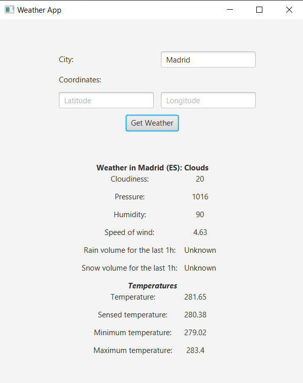
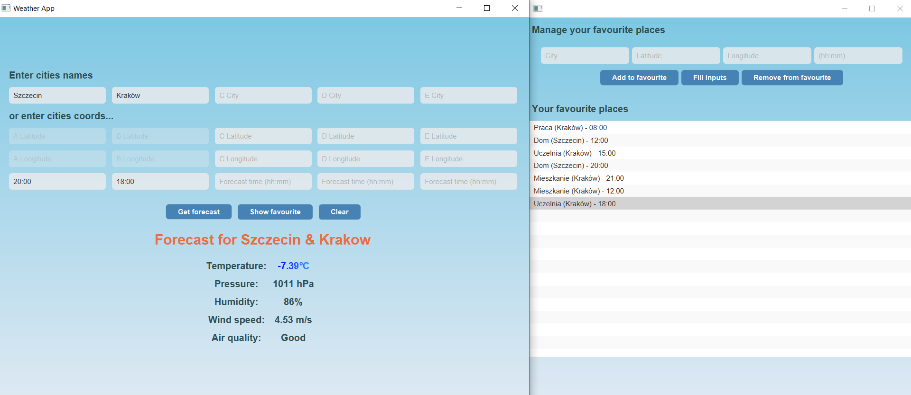

# Dokumentacja projektu WeatherAPP

## Autorzy
- Paweł Motyka
- Marcin Saja
- Michał Czajor
- Adrian Żerebiec

## Cel aplikacji

Nasza aplikacja jest przeznaczona dla osób chcących sprawdzić pogodę przed wyjściem z domu. Powinna ona pomóc w doborze odpowiednich ubrań w zależności od aur panującej za oknem o danej porze.

## Wersja Javy oraz Gradle'a

W naszym projekcie korzystamy z Java17. Zalecaną wersją Gradle'a jest natomiast Gradle 8.4. . JVM musi być w wersji 17 lub wyższej.

## Uruchomienie projektu

Program uruchamiamy poleceniem `gradlew run` w głównym katalogu projektu. W pewnych sytuacjach jednak mogą się pojawić problemy. Wtedy zalecamy, aby skorzystać z komendy `gradle run`.
Jeśli i to nie pomoże, najlepiej usunąć z plików gradle-wrapper.jar znajdujących się w gradle/wrapper. Wtedy trzeba uruchomić program z pomocą komendy `gradle wrapper run`.

## Milestone 1

W tym Milesone'ie naszym celem było stworzenie pierwszej wersji aplikacji, która pozwala nam na uzyskanie informacji o pogodzie w danym miejscu.
To, jaka jest pogoda, możemy uzyskać dzięki wprowadzeniu w GUI koordynatów lub nazwy miejscowości, a zewnętrzne API zwróci nam informacje o pogodzie.

### Pomysł

W celu stworzenia aplikacji postanowiliśmy użyć wzorca projektowego MVP. Pozwala nam to oddzielić warstwę biznesową od widoku aplikacji. To zapewnia nam, że każdy z komponentów ma swoje konkretne zadanie, i ewentualna zmiana jednego z nich nie powoduje konieczności dużych zmian w reszcie.
Interface aplikacji stworzyliśmy za pomocą FXML, dzięki czemu zmiany w wyglądzie mogą być niezależne od reszty.

#### Dlaczego MVP?

Wzorzec MVP pozwala nam na oddzielenie logiki biznesowej od widoku. Dzięki temu możemy łatwo zmieniać widok aplikacji bez konieczności zmiany logiki biznesowej.
Dodatkowo dzięki temu wzorcowi możemy łatwo testować aplikację. Co więcej, w sposób zdecydowany pomogło nam w zorganizowaniu pracy w grupie, gdyż mogliśmy pracować niezależnie od siebie w wielu przypadkach.

#### Dlaczego converter?

Converter pozwala nam na konwersję danych z formatu JSON na obiekt klasy WeatherData. Dzięki temu możemy łatwo operować na danych otrzymanych z API.

#### Dlaczego Logger?

Dzięki Loggerowi możemy łatwo logować informacje o działaniu aplikacji. To pozwala nam łatwiej znaleźć ewentualne błędy w aplikacji.

#### Dlaczego wykorzystaliśmy Guice?

Guice pozwala nam na wstrzykiwanie zależności. Dzięki niemu klasy nie muszą tworzyć obiektów zależności samodzielnie, co ułatwia zmianę implementacji bez zmiany kodu klas klientów.
Wstrzykiwanie zależności ułatwia nam także podstawianie atrap obiektów podczas testowania. Co więcej, zależności są zdefiniowane w oddzielnych modułach, a to ułatwia nam dodawanie nowych funkcji do aplikacji.

### Opis działania

Po uruchomieniu aplikacji, użytkownikowi wyświetla się okno, w którym może wprowadzić nazwę miasta lub jego koordynaty. Po wprowadzeniu danych i kliknięciu przycisku "Search" aplikacja pobiera dane z zewnętrznego API i wyświetla je użytkownikowi.

### Zależności

W projekcie użyliśmy następujących zależności:
```
dependencies {
	testImplementation group: 'org.junit.jupiter', name: 'junit-jupiter-api', version: '5.10.1'
    testRuntimeOnly group: 'org.junit.jupiter', name: 'junit-jupiter-engine', version: '5.10.1'
    implementation("com.squareup.okhttp3:okhttp:4.11.0")
    implementation 'com.google.code.gson:gson:2.10.1'
    implementation group: 'com.google.inject', name: 'guice', version: '5.0.1'
    testImplementation 'org.mockito:mockito-core:3.12.4'
    testImplementation "org.testfx:testfx-core:4.0.17"
    testImplementation group: 'org.hamcrest', name: 'hamcrest', version: '2.1'
    testImplementation "org.testfx:testfx-junit5:4.0.17"
}

```
Pierwsze dwie zależności są potrzebne do testowania aplikacji. Do testowania aplikacji również przydatne jest mockito, gdyż pozwala nam na tworzenie atrap.
OkHttp3 pozwala nam na komunikację z zewnętrznym API. Dzięki Gson'owi możemy łatwiej konwertować przydatne nam w implementacjach informacje. Guice natomiast pozwala nam na wstrzykiwanie zależności.
TestFX pozwala nam na testowanie aplikacji z GUI w stosunkowo łatwy sposób.

### Struktura projektu

Nasz projekt podzielony jest na wiele pakietów oraz klas. Poniżej przedstawiamy krótki schemat struktury projektu.

```
- src/
   - main/
      - java/
         - pl.edu.agh.to2.WeatherApp/
            - api/
            - exceptions/
            - logger/
            - model/
            - presenter/
            - utils/
            - view/
            - App.java
            - Main.java
      - resources/
        - pl.edu.agh.to2.WeatherApp/
  - test/
    - java/
      - pl.edu.agh.to2.WeatherApp/
            - api/
            - logger/
            - model/
            - presenter/
            - view/
            -MainTest.java
```
### Opisy pakietów i klas
#### Pakiet api
Pakiet Api zawiera klasy odpowiedzialne za komunikację z zewnętrznym API pogodowym. W tym celu wykorzystujemy bibliotekę OkHttp3.

Klasy:
1. **WeatherDataProvider**: wykonuje zapytania do api pogodowego i zwraca dane dotyczące pogody.

#### Pakiet exceptions

Pakiet exceptions zawiera klasy odpowiedzialne za obsługę wyjątków.

Klasy:
1. **DataFetchException**: klasa odpowiedzialna za obsługę wyjątków związanych z pobieraniem danych

#### Pakiet logger
Zawiera metody pozwalające na logowanie informacji oraz ewentualnych błędów w aplikacji.

Klasy:
1. **ConsoleSerializer**: klasa odpowiedzialna za logowanie informacji w konsoli
2. **IMessageSerializer**: interfejs zawierający metody pozwalające na logowanie informacji
3. **Logger**: klasa odpowiedzialna za obsługę logowania informacji


#### Pakiet model
Zawiera elementy modelu, konwertuje na obiektu klasy WeatherData za pomocą biblioteki GSon.

Klasy:
1. **WeatherModule**: definiuje dostawców dla interfejsów, zapewniając im konkretne implementacje, z pomocą Guice
2. **WeatherModel**: interfejs zawierający metody pozwalające na pobranie informacji o pogodzie
3. **weatherData/WeatherData**: klasa zawierająca informacje o pogodzie przygotowana z myślą o API OpenWeatherMap
4. **weatherData/JsonData/...**: w tym katalogu znajdują się klasy poszczególnych elementów modelu takie jak:
   - CloudsDTO: klasa zawierająca informacje o zachmurzeniu procentowym
   - CoordDTO: klasa zawierająca informacje o współrzędnych geograficznych
   - MainInfoDTO: klasa zawierająca informacje o temperaturze, ciśnieniu, wilgotności czy odczuwalnej temperaturze
   - SysDTO: klasa zawierająca informacje o kraju, godzinie wschodu i zachodu słońca
   - TotalFallDTO: klasa zawierająca informacje o opadach w ciągu ostatniej godziny oraz w ciągu ostatnich 3 godzin
   - WeatherDTO: klasa zawierająca informacje o pogodzie (np. opis, ikona)
   - WindDTO: klasa zawierająca informacje o wietrze (np. prędkość, kierunek)
5. **Impl/WeatherModelImpl**: klasa implementująca interfejs WeatherModel, zawiera metody pozwalające na asynchroniczne pobranie informacji o pogodzie
6. **converter/GsonConverter**: klasa odpowiedzialna za konwersję danych z formatu JSON na obiekt klasy WeatherData
7. **converter/IResponseToModelConverter**: interfejs zawierający metodę pozwalające na konwersję danych z formatu JSON na obiekt klasy WeatherData

#### Pakiet presenter
Zawiera implementację prezentera odpowiedzialną za komunikację między widokiem a modelem.

Klasy:
1. **WeatherPresenter**: interfejs zawierający metody pozwalające na komunikację między widokiem a modelem
2. **WeatherPresenterImpl**: obsługuje prezentację danych w widoku WeatherView, jednocześnie komunikując się z modelem WeatherModel

#### Pakiet utils
Ułatwia ładowanie widoków fxml.

Klasy:
1. **FXMLLoaderUtility**: pomocnicza klasa do ładowania widoków fxml

#### Pakiet view
Zawiera implementację widoku.

Klasy:
1. **WeatherView**: zajmuje się wyświetlaniem widoku aplikacji, komunikuje się z modelem poprzez prezentera

#### Osobne klasy
1. **App**: zawiera metody odpowiedzialne za inicjalizację aplikacji oraz za wystartowanie
2. **Main**: uruchamia aplikację

#### Testy jednostkowe

W celu testowania aplikacji stworzyliśmy testy jednostkowe. Sprawdzają one poprawność działania najczęściej używanych metod np. setterów, convertera czy apiCaller.
Dzięki nim możemy łatwo sprawdzić, czy poszczególne komponenty aplikacji działają poprawnie.

### Diagram zależności
Poniższy diagram przedstawia zależności między klasami w naszym projekcie.


Jak widać, w naszym projekcie występuje dużo zależności.
Przede wszystkim możemy zauważyć zależność wynikającą z zastosowania wzorca MVP.
Widzimy, że WeatherPresenter jest pośrednikiem w porozumiewaniu się między widokiem WeatherView a modelem WeatherModel.
Nie może także dziwić, iż koniec końców wszystko sprowadza się do naszej App, które obsługuje naszą aplikację.

### Przykład działania



Jak widać po wprowadzeniu nazwy miasta i kliknięciu przycisku "Search" aplikacja pobiera dane z zewnętrznego API i wyświetla je użytkownikowi.
Możemy zauważyć, iż pogoda w Madrycie jest pochmurna, a ciśnienie do około 1016 hPa.
Dodatkowo możemy sprawdzać pogodę po koordynatach geograficznych.


Widzimy, że aplikacja działa poprawnie i wyświetla nam informacje o pogodzie w danym miejscu.


### Podsumowanie

W tym Milestone'ie udało nam się stworzyć szkielet aplikacji, który pozwala na pobieranie informacji o pogodzie z zewnętrznego API.
Dzięki zastosowaniu wzorca MVP możemy łatwo zmieniać widok aplikacji bez konieczności zmiany logiki biznesowej.
Naszym zdaniem, dzięki zastosowaniu Guice, MVP itp., nasz projekt jest skalowalny i łatwy w rozbudowie.


## Milestone 2

W tym Milestone'ie naszym celem było rozszerzenie możliwości aplikacji. Od teraz chcemy, aby użytkownik mógł sprawdzić pogodę w dwóch miejscach jednocześnie.
Może to być przydatne, np. możemy sprawdzić pogodę w miejscu pracy i w miejscu zamieszkania. Dodatkowo dodaliśmy ikonki pogody oraz maseczki.

### Pomysł

Naszym głównym zamysłem było to, aby zbytnio nie komplikować i nie zmieniać struktury projektu. Dlatego też postanowiliśmy rozszerzyć nasz model o nowe klasy i funkcjonalności.
Dodatkowo postanowiliśmy popracować nad wyglądem aplikacji, aby była bardziej przyjemna dla użytkownika.

#### Dlaczego dodaliśmy ikonki pogody?

Dodaliśmy ikonki pogody, aby ułatwić użytkownikowi korzystanie z aplikacji. Dzięki nim użytkownik może szybko sprawdzić pogodę w danym miejscu, bez konieczności czytania opisu pogody.

#### Dlaczego dodaliśmy maseczki?

W wielkich miastach smog jest poważnym problemem. Dlatego też postanowiliśmy dodać maseczki, aby użytkownik mógł łatwo sprawdzić, czy powinien założyć maseczkę, czy nie.

#### Jak działa WeatherDataMerger?

WeatherDataMerger pozwala nam na scalenie danych o pogodzie z dwóch różnych miejsc. Scalamy te, które wydają się nam ważniejsze, czyli np. uwzględniamy niższą temperaturę, gdy w jednym z miejsc potrzeba maseczki to uznajemy, że w obydwu itp.
Ogólniej rzecz biorąc, klasa ta pozwala nam przygotować te dane, które chcemy wyświetlić użytkownikowi, uwzględniając podane miejsca.

#### Dlaczego dodaliśmy drugie miejsce?

Dodaliśmy drugie miejsce, aby użytkownik mógł sprawdzić pogodę w dwóch miejscach jednocześnie. Może to być przydatne, np. możemy sprawdzić pogodę w miejscu pracy i w miejscu zamieszkania.

#### Dlaczego dodaliśmy Geocoding?

Geocoding pozwala nam na pobranie koordynatów geograficznych na podstawie nazwy miejscowości. Dzięki temu możemy łatwo sprawdzić pogodę w danym miejscu, bez konieczności wpisywania koordynatów.
Było nam to szczególnie potrzebne przy otrzymywaniu informacji o zanieczyszczeniu powietrza, gdyż API OpenWeatherMap nie pozwala na pobranie informacji o zanieczyszczeniu powietrza po nazwie miejscowości.

### Opis działania

Aplikacja działa analogicznie jak w poprzednim Milestone'ie. Po uruchomieniu aplikacji, użytkownikowi wyświetla się okno, w którym może wprowadzić nazwę miasta lub jego koordynaty. Jednak od teraz możemy sprawdzać pogodę w dwóch miejscach jednocześnie, podając nazwy miejscowości lub koordynaty obydwu miejsc.
Po wprowadzeniu danych i kliknięciu przycisku "Get Weather" aplikacja pobiera dane z zewnętrznego API i wyświetla je użytkownikowi wraz z odpowiednimi ikonkami.

### Zależności

Nie zmieniliśmy zależności w stosunku do poprzedniego Milestone'a. Zatem nadal używamy następujących zależności:
```
dependencies {
    testImplementation group: 'org.junit.jupiter', name: 'junit-jupiter-api', version: '5.10.1'
    testRuntimeOnly group: 'org.junit.jupiter', name: 'junit-jupiter-engine', version: '5.10.1'
    implementation("com.squareup.okhttp3:okhttp:4.11.0")
    implementation 'com.google.code.gson:gson:2.10.1'
    implementation group: 'com.google.inject', name: 'guice', version: '5.0.1'
    testImplementation 'org.mockito:mockito-core:3.12.4'
    testImplementation "org.testfx:testfx-core:4.0.17"
    testImplementation group: 'org.hamcrest', name: 'hamcrest', version: '2.1'
    testImplementation "org.testfx:testfx-junit5:4.0.17"
}

```

### Struktura projektu

W tym Milestone'ie nie zmieniliśmy struktury projektu znacznie, zatem nadal mamy kluczowy podział stworzony w oparciu o MVP.
Jednak w tym Milestone'ie dodaliśmy nowe klasy, które rozszerzają nasz model, a także wiele z klas zostało zmodyfikowanych.

### Opisy pakietów i klas

Z racji tego, że w tym Milestone'ie kontynuujemy pracę nad tym samym projektem, nie będziemy opisywać ponownie wszystkich pakietów i klas, lecz tylko te, które uległy zmianie i zostały dodane.

#### Pakiet api 

Pakiet Api zawiera klasy odpowiedzialne za komunikację z zewnętrznym API pogodowym. W tym celu wykorzystujemy bibliotekę OkHttp3.

Dodane/zmodyfikowane klasy:
1. **DataProvider**: wykonuje zapytania do api pogodowego i zwraca dane dotyczące pogody. Od teraz także pobiera dane o zanieczyszczeniu powietrza oraz pomaga w uzyskiwaniu ikon. Dodatkowo została ona zrefaktoryzowana, aby była bardziej czytelna.

#### Pakiet exceptions

Pakiet exceptions zawiera klasy odpowiedzialne za obsługę wyjątków.

Dodane/zmodyfikowane klasy:
1. **DataFetchException**: klasa odpowiedzialna za obsługę wyjątków związanych z pobieraniem danych
2. **GeocodingException**: klasa odpowiedzialna za obsługę wyjątków związanych z geokodowaniem

#### Pakiet logger

Nie uległ zmianie w stosunku do poprzedniego Milestone'a.

#### Pakiet model

Zawiera elementy modelu, konwertuje na obiekty klasy WeatherData za pomocą biblioteki GSon. Od teraz posiada także elementy związane z AirPolutionData oraz GeocodingData.

Dodane/zmodyfikowane klasy:
1. **airPollutionData/json/AirPollutionData**: klasa zawierająca informacje o zanieczyszczeniu powietrza, przygotowana z myślą o API OpenWeatherMap.
2. **airPollutionData/json/ComponentsDTO**: klasa zawierająca informacje o zanieczyszczeniu powietrza (np. dwutlenek siarki, dwutlenek azotu, ozon)
3. **airPollutionData/json/AirMainInfoDTO**: klasa posiada dokładną informację o poziomie zanieczyszczenia w skali 1-5
4. **airPollutionData/AirListElementDTO**: klasa trzymająca MainInfoDTO oraz ComponentsDTO
5. **geoCodingData/GeocodingData**: klasa zawierająca informacje o geokodowaniu przygotowana z myślą o API OpenWeatherMap.
6. **impl/WeatherModelImpl**: klasa implementująca interfejs WeatherModel, zawiera metody pozwalające na asynchroniczne pobranie informacji o pogodzie, zanieczyszczeniu powietrza oraz geokodowaniu.
7. **responseConverter/GsonConverter**: klasa odpowiedzialna za konwersję danych z formatu JSON na obiekt klasy WeatherData i AirPollutionData.
8. **weatherData/WeatherData**: klasa zawierająca informacje o pogodzie przygotowana z myślą o API OpenWeatherMap, teraz także zawiera informacje o zanieczyszczeniu powietrza.
9. **weatherData/WeatherDataMerger**: klasa odpowiedzialna za scalanie danych o pogodzie i zanieczyszczeniu powietrza z dwóch różnych miejsc.

#### Pakiet presenter

Zawiera implementację prezentera odpowiedzialną za komunikację między widokiem a modelem.

Dodane/zmodyfikowane klasy:
1. **impl/WeatherPresenterImpl**: obsługuje prezentację danych w widoku WeatherView, jednocześnie komunikując się z modelem WeatherModel. Od teraz obsługuje zapytania dla dwóch miejsc, a także dodaje ikonki. Ustala również na podstawie aktualnej pogody, czy należy założyć maseczkę oraz kolor wskazywanej temperatury.


#### Pakiet utils

Zawiera dodatkowe pomocnicze metody i klasy.

Dodane/zmodyfikowane klasy:
1. **Constants**: pomocnicza klasa zawierająca stałe
2. **TempCalculator**: pomocnicza klasa do obliczania temperatury odczuwalnej na podstawie wzoru
3. **converter/AirQualityConverter**: klasa odpowiedzialna za obrobienie danych o zanieczyszczeniu powietrza, aby były bardziej czytelne dla użytkownika

#### Pakiet view

Zawiera implementację widoku.

Klasy:
1. **WeatherView**: zajmuje się wyświetlaniem widoku aplikacji, komunikuje się z modelem poprzez prezentera. Teraz możemy wprowadzać dwa miejsca, a także wyświetlać ikonki pogody. Dodatkowo wyświetla temperaturę w kolorach ustalonych w prezenterze.


### Diagram zależności
Poniższy diagram przedstawia zależności między klasami w naszym projekcie.


Jak widać, liczba zależności trochę się zwiększyła. Niezachwiany został jednak podział na przyjęty na początku zgodny ze wzorcem MVP. 

### Przykład działania

Poniżej przedstawiamy przykładowe działanie aplikacji. Pokażemy każdy z możliwych wariantów.

#### Jedno miasto

<p align="center">
  
</p>

Jak widać, aplikacja działa analogicznie jak w poprzednim Milestone'ie. Po wprowadzeniu nazwy miasta i kliknięciu przycisku "Get Weather" aplikacja pobiera dane z zewnętrznego API i wyświetla je użytkownikowi, jednak teraz dodatkowo wyświetla ikonki pogody oraz maseczki.

#### Dwa miasta

<p align="center">
  
</p>

Możemy zauważyć, iż od teraz możemy sprawdzać pogodę w dwóch miejscach naraz. Dane są odpowiednio złączone za pomocą WeatherDataMerger, aby użytkownik znał najistotniejsze szczegóły. 

#### Dwa miasta — parasolka

<p align="center">
  
</p>

Od teraz dodatkowo, jeśli w jednym z miejsc jest deszcz, to aplikacja wyświetla ikonkę parasolki.

#### Nie odnaleziono miasta

<p align="center">
  
</p>


W przypadku, gdy nie odnajdziemy miasta, aplikacja wyświetla stosowny komunikat.

#### Koorodynaty geograficzne

<p align="center">
  
</p>

Możemy także sprawdzać pogodę po koordynatach geograficznych. Działa to analogicznie jak w przypadku nazwy miasta.

### Jakie problemy napotkaliśmy?

Największym problemem, z którym się spotkaliśmy, było dodanie drugiego miejsca. Wymagało to zmiany wielu klas, a także dodania nowych. Dodatkowo musieliśmy zmodyfikować widok, aby wyświetlał dane w odpowiedni sposób.
Bardzo dużo czasu zajęło nam połączenie informacji z obydwu miejsc, gdyż musieliśmy ustalić, które informacje są najważniejsze.
Nieco problemów sprawiło nam także dodanie ikonek pogody, gdyż musieliśmy zmodyfikować widok, a także dodać klasy, które pomogły nam w pobieraniu ikonek.

Jeszcze jednym z napotkanych problemów był brak obsługi miast podczas pobierania informacji o zanieczyszczeniu powietrza. Musieliśmy dodać Geocoding, aby móc pobierać informacje o zanieczyszczeniu powietrza po nazwie miasta.
W testach natomiast najtrudniej było obejść problem z pobieraniem danych z zewnętrznego API. Musieliśmy użyć mockito, aby móc testować aplikację.

Warto także wspomnieć o sporej liczbie zmiany związanych z SolarLint. Wiązało się to ze sporą liczbą warningów, które musieliśmy naprawić.

### Podsumowanie

W tym Milestone'ie udało nam się rozszerzyć możliwości aplikacji. Poprawiliśmy znacząco wygląd aplikacji, a także
wprowadzić nowe funkcjonalności takie jak wyświetlanie ikonek pogody czy maseczek.
Aplikacja stała się bardziej przydatna dla użytkowników, gdyż mogą sprawdzać pogodę w dwóch miejscach, co pozwala zaoszczędzić sporo czasu.
Dzięki zmianom z aplikacji korzysta się o wiele przyjemniej.


## Milestone 3

W tym Milestone'ie naszym celem było rozszerzenie możliwości aplikacji. Od teraz chcemy, aby użytkownik mógł sprawdzić pogodę w 5 miejscach jednocześnie.
Do tego dodaliśmy możliwość zapisywania ulubionych miejsc, a także możemy teraz sprawdzać pogodę o danej porze dnia.

### Pomysł

Naszym głównym zamysłem było to, aby zbytnio nie komplikować i nie zmieniać struktury projektu. Dlatego też postanowiliśmy rozszerzyć nasz model o nowe klasy i funkcjonalności.

#### Dlaczego dodaliśmy możliwość zapisywania ulubionych miejsc?

Dodaliśmy możliwość zapisywania ulubionych miejsc, aby użytkownik mógł łatwo sprawdzić pogodę w swoich ulubionych miejscach. Dzięki temu nie musi wpisywać nazwy miasta czy koordynatów, a jedynie wybrać z listy.

#### Dlaczego dodaliśmy możliwość sprawdzania pogody o danej porze dnia?

Dodaliśmy możliwość sprawdzania pogody o danej porze dnia, aby użytkownik mógł sprawdzić pogodę w danym miejscu o danej porze dnia. Dzięki temu może sprawdzić, czy w danym miejscu będzie padać o danej godzinie i odpowiednio się do tego przygotować.

#### Jak działa nasza baza danych?

Nasza baza danych oparta jest na jsonie, gdyż jest ona bardzo mała. Dzięki temu możemy łatwo zapisywać i odczytywać dane z bazy danych. Dodatkowo możemy łatwo dodawać nowe miejsca do bazy danych.
Json wydawał się bardzo dobrym wyborem ze względu na prostotę i łatwość obsługi oraz dlatego, że nasza baza prawdopodobnie nie rozrośnie się zbyt bardzo.

#### Dlaczego dodaliśmy możliwość sprawdzania pogody w 5 miejscach jednocześnie?

Dodaliśmy możliwość sprawdzania pogody w 5 miejscach jednocześnie, aby użytkownik mógł łatwo sprawdzić pogodę w wielu miejscach. Dzięki temu może sprawdzić pogodę w wielu miejscach bez konieczności wpisywania nazwy miasta czy koordynatów.

### Opis działania

Aplikacja działa analogicznie jak w poprzednim Milestone'ie. Po uruchomieniu aplikacji, użytkownikowi wyświetla się okno, w którym może wprowadzić nazwę miasta lub jego koordynaty. Jednak od teraz możemy sprawdzać pogodę w 5 miejscach jednocześnie, podając nazwy miejscowości lub koordynaty miejsc.

### Zależności

Nie zmieniliśmy zależności w stosunku do poprzedniego Milestone'a. Zatem nadal używamy następujących zależności:
```
dependencies {
    testImplementation group: 'org.junit.jupiter', name: 'junit-jupiter-api', version: '5.10.1'
    testRuntimeOnly group: 'org.junit.jupiter', name: 'junit-jupiter-engine', version: '5.10.1'
    implementation("com.squareup.okhttp3:okhttp:4.11.0")
    implementation 'com.google.code.gson:gson:2.10.1'
    implementation group: 'com.google.inject', name: 'guice', version: '5.0.1'
    testImplementation 'org.mockito:mockito-core:3.12.4'
    testImplementation "org.testfx:testfx-core:4.0.17"
    testImplementation group: 'org.hamcrest', name: 'hamcrest', version: '2.1'
    testImplementation "org.testfx:testfx-junit5:4.0.17"
}
  
 ```

### Struktura projektu

W tym Milestone'ie nie zmieniliśmy struktury projektu znacznie, zatem nadal mamy kluczowy podział stworzony w oparciu o MVP.

### Opisy pakietów i klas

Z racji tego, że w tym Milestone'ie kontynuujemy pracę nad tym samym projektem, nie będziemy opisywać ponownie wszystkich pakietów i klas, lecz tylko te, które uległy zmianie i zostały dodane.

#### Pakiet api

Został rozszerzony o możliwość pobierania prognozy pogody na 5 dni.

Dodane/zmodyfikowane klasy:
1. **DataProvider**: wykonuje zapytania do api pogodowego i zwraca dane dotyczące pogody. Od teraz także pobiera dane o zanieczyszczeniu powietrza oraz pomaga w uzyskiwaniu ikon. Dodatkowo została ona zrefaktoryzowana, aby była bardziej czytelna.

#### Pakier exceptions

Został rozszerzony o nowe wyjątki.

Dodane/zmodyfikowane klasy:
1. **DataSerializationException**: klasa odpowiedzialna za obsługę wyjątków związanych z serializacją danych
2. **FailedToLogException**: klasa odpowiedzialna za obsługę wyjątków związanych z logowaniem danych
3. **FavouriteListReloadException**: klasa odpowiedzialna za obsługę wyjątków związanych z odczytem ulubionych miejsc
4. **ItemAlreadyExistsException**: klasa odpowiedzialna za obsługę wyjątków związanych z dodawaniem ulubionych miejsc
5. **TimeNotFoundException**: klasa odpowiedzialna za obsługę wyjątków związanych z pobieraniem prognozy pogody

#### Pakiet logger

Został rozszerzony o klasę odpowiedzialną za logowanie danych do pliku.

Dodane/zmodyfikowane klasy:
1. **FileSerializer**: klasa odpowiedzialna za logowanie informacji do pliku

#### Pakiet model

Został rozszerzony o możliwość pobierania prognozy pogody na 5 dni.

Dodane/zmodyfikowane klasy:
1. **forecast_data/ForecastData**: klasa zawierająca informacje o prognozie pogody przygotowana z myślą o API OpenWeatherMap.
2. **forecast_data/CityDTO**: klasa zawierająca informacje o mieście (np. nazwa, koordynaty)

#### Pakiet persistence

Został dodany pakiet odpowiedzialny za obsługę bazy danych.

Dodane/zmodyfikowane klasy:
1. **Dao**: interfejs zawierający metody pozwalające na zapisywanie i odczytywanie danych z bazy danych
2. **favourite/Favourite**: klasa zawierająca informacje o ulubionym miejscu
3. **favourite/FavouriteDao**: klasa implementująca interfejs Dao, zawiera metody pozwalające na zapisywanie i odczytywanie ulubionych miejsc
4. **favourite/FavouriteList**: klasa zawierająca listę ulubionych miejsc

#### Pakiet presenter

Został rozszerzony o możliwość pobierania prognozy pogody na 5 dni.

Dodane/zmodyfikowane klasy:
1. **impl/FavouritePresenterImpl**: obsługuje prezentację danych w widoku FavouriteView, jednocześnie komunikując się z modelem FavouriteModel
2. **IFavouritePresenter**: interfejs zawierający metody pozwalające na komunikację między widokiem a modelem
3. **impl/WeatherPresenterImpl**: obsługuje prezentację danych w widoku WeatherView, jednocześnie komunikując się z modelem WeatherModel, teraz także przetwarzamy dane o prognozie pogody

#### Pakiet utils

Nie uległ zmianie w stosunku do poprzedniego Milestone'a.

#### Pakiet view

Został rozszerzony o możliwość wyboru 5 miejsc oraz o możliwość wyboru godziny. Dodatkowo został dodany widok FavouriteView.

Dodane/zmodyfikowane klasy:
1. **FavouriteView**: zajmuje się wyświetlaniem widoku aplikacji, komunikuje się z modelem poprzez prezentera, pozwalając na dodawanie i usuwanie ulubionych miejsc
2. **WeatherView**: zajmuje się wyświetlaniem widoku aplikacji, komunikuje się z modelem poprzez prezentera. Teraz możemy wprowadzać pięć miejsc, a także wyświetlać ikonki pogody. Dodatkowo wyświetla temperaturę w kolorach ustalonych w prezenterze.

### Diagram zależności

Poniższy diagram przedstawia zależności między klasami w naszym projekcie.


Mimo że liczba zależności znacznie się zwiększyła, to nadal zachowaliśmy podział na przyjęty na początku zgodny ze wzorcem MVP.

### Przykład działania

Poniżej przedstawiamy przykładowe działanie aplikacji. Pokażemy każdy z możliwych wariantów.

#### Wyszukanie dla jednego miasta

<p align="center">
  

Jak widać od teraz mamy dużo więcej okienek, w których możemy wprowadzić dane. Dodatkowo możemy wybrać godzinę, o której chcemy sprawdzić pogodę.

#### Dwa miasta

<p align="center">
  

Możemy zauważyć, że dane jak poprzednio są mergowane za pomocą WeatherDataMerger. Dodatkowo możemy wybrać godzinę, o której chcemy sprawdzić pogodę.

#### Więcej miast

<p align="center">
  

Od teraz możemy sprawdzać pogodę w 5 miejscach jednocześnie.

#### Wyszukanie dla koordynatów

<p align="center">
  

Możemy także sprawdzać pogodę po koordynatach geograficznych. Działa to analogicznie jak w przypadku nazwy miasta.

#### Ulubione miejsca

<p align="center">
  

Możemy także dodawać ulubione miejsca, aby łatwo sprawdzić pogodę w swoich ulubionych miejscach.

### Co z perspektywy czasu moglibyśmy zrobić lepiej?

Z perspektywy czasu, mogliśmy pomyśleć nad wykorzystaniem innego wzorca projektowego np. MVVC.
Mogliśmy także, lepiej rozplanowywać czas, aby nie zostawiać wszystkiego na ostatnią chwilę.
Warto także wspomnieć, że mogliśmy od razu przygotowywać się pod niektóre zmiany, które pojawiły się w kolejnych Milestone'ach.

### Jakie problemy napotkaliśmy?

Największym problemem, z którym się spotkaliśmy, było dodanie możliwości wyboru 5 miejsc. Wymagało to zmiany wielu klas, a także dodania nowych. Dodatkowo musieliśmy zmodyfikować widok, aby wyświetlał dane w odpowiedni sposób.
Problematyczne było również pisanie testów, gdyż nie wszystko dało się przetestować. Musieliśmy użyć mockito, ale czasem problem wynikał z prywatności metod.
Wiele kłopotów sprawiło nam także dodanie możliwości wyboru godziny, gdyż musieliśmy zmodyfikować widok, a także dodać klasy, które pomogły nam w pobieraniu prognozy pogody.

### Które części były najprzyjemniejsze do pisania?

Bardzo przyjemnie dodawało się elementy, które mogliśmy już zobaczyć w naszej aplikacji, np. ikonki albo całą prognozę pogody.
Również pisanie testów było całkiem ciekawe i rozwijające, jednak jak wyżej wspomnieliśmy, nie wszystko dało się przetestować.
Myślimy, że także dodawanie ulubionych miejsc było całkiem przyjemne, gdyż mogliśmy zobaczyć, że nasza aplikacja jest coraz bardziej funkcjonalna.

### Czy przerwa świąteczna miała wpływ na pracę nad projektem?

Przerwa zdecydowanie miała wpływ na pracę nad projektem. Z jednej strony mogliśmy odpocząć od projektu, jednak po czasie nie wszystko w kodzie jest takie oczywiste, jak było.
Jak to studenci mają w zwyczaju, zostawiliśmy wszystko na ostatnią chwilę, co nie było najlepszym pomysłem. Warto było wcześniej zacząć pracę nad projektem, przynajmniej ten dzień wcześniej.
Jednak koniec konców udało nam się zrealizować wszystkie założenia, które sobie postawiliśmy.


### Podsumowanie

W tym Milestone'ie udało nam się rozszerzyć możliwości aplikacji. Od teraz aplikacja jest zdecydowanie bardziej funkcjonalna i pozwala na o wiele więcej.
Możemy sprawdzać pogodę w wielu miejscach jednocześnie, a także możemy dodawać ulubione miejsca, aby łatwo sprawdzić pogodę w swoich ulubionych miejscach.
Dzięki zmianom z aplikacji korzysta się o wiele przyjemniej.